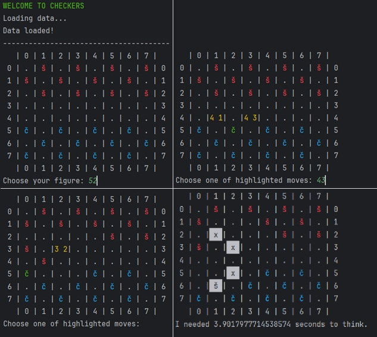

# Minimax Checkers Game

This is a simple implementation of a Checkers game using the Minimax algorithm. The game allows player to play against a computer opponent, which is being controlled by the Minimax algorithm.

## Game Features
- Two-player Checkers game (Player vs Computer)
- Minimax algorithm for the computer opponent
- Basic game rules and mechanics implemented
- The King - When a piece reaches the opponent's back row, it becomes a King and can move both forward and backward
- Multiple jumps - If a piece can capture multiple opponent pieces in a single turn, it can do so by jumping over them consecutively



## Opponent Algorithm
The computer opponent uses the Minimax algorithm to make decisions. It uses Alpha-Beta pruning to optimize the search process and make more efficient decisions. The algorithm evaluates the game state and chooses the best move based on a heuristic evaluation function. The evaluation function considers factors such as the number of pieces, the position of pieces, and potential threats to determine the best move for the computer opponent. The game is saving Hash Map of the game states to optimize the Minimax algorithm and avoid redundant calculations.

## How to Play
1. Clone the repository to your local machine.
2. Run the main game file to start the game
```
    python main.py
```
3. To select a piece, type in the coordinates of the piece you want to move. For example, if you want to select the piece at row 2 and column 3, you would enter `23`.
4. After selecting a piece, you will be prompted to enter the coordinates of the destination square. For example, if you want to move the piece to row 3 and column 4, you would enter `34`.
5. The game will alternate turns between the player and the computer opponent until one of them wins by capturing all of the opponent's pieces or blocking all possible moves.

## License
This project is licensed under the MIT License - see the [LICENSE](LICENSE) file for details.